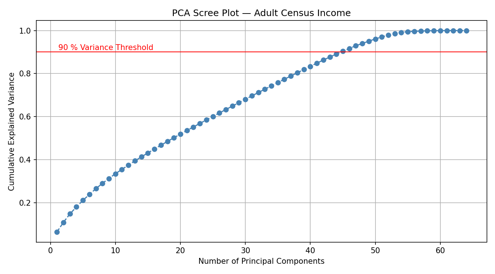
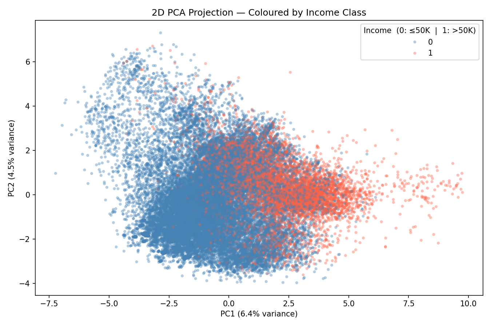
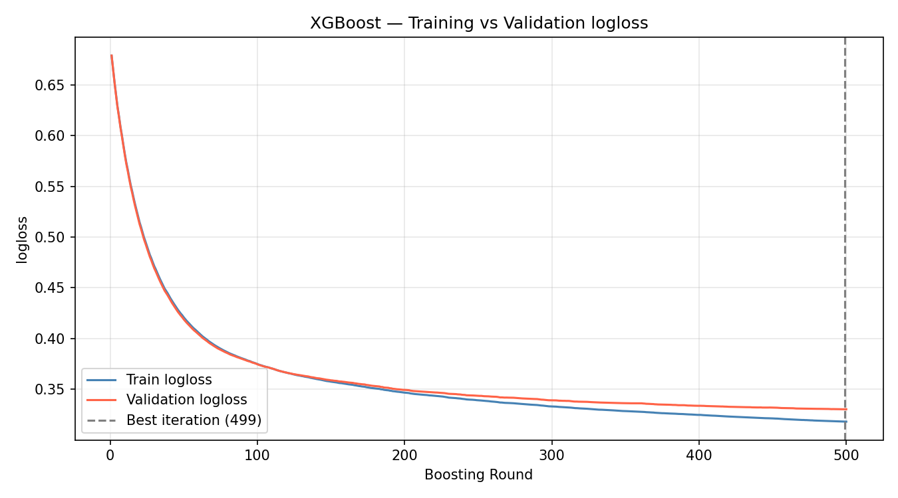
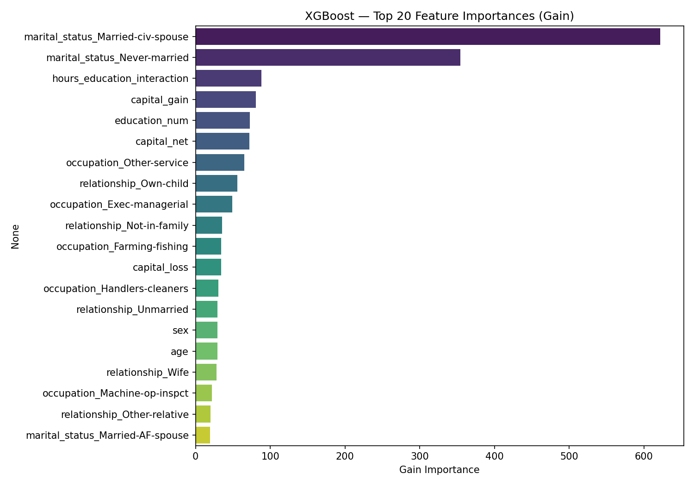
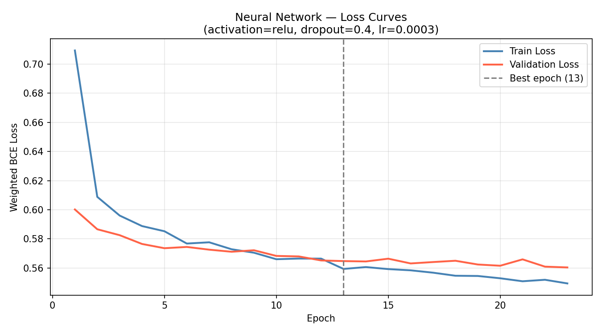
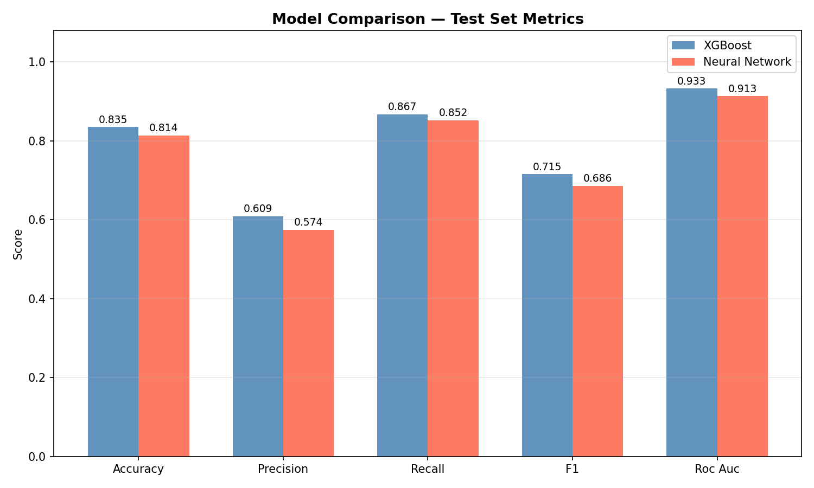
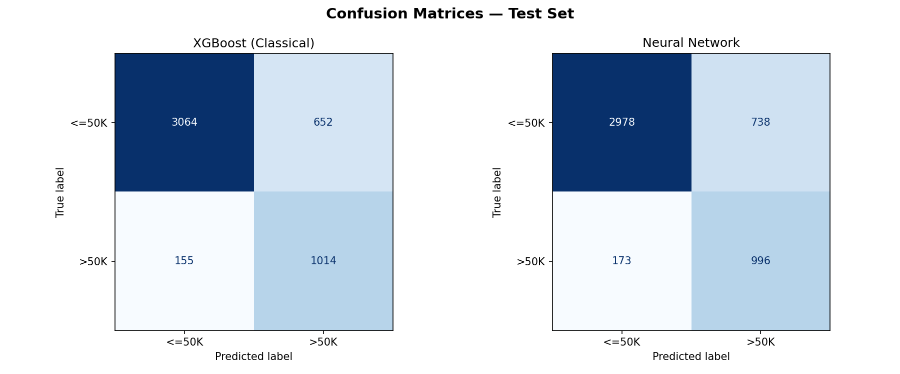
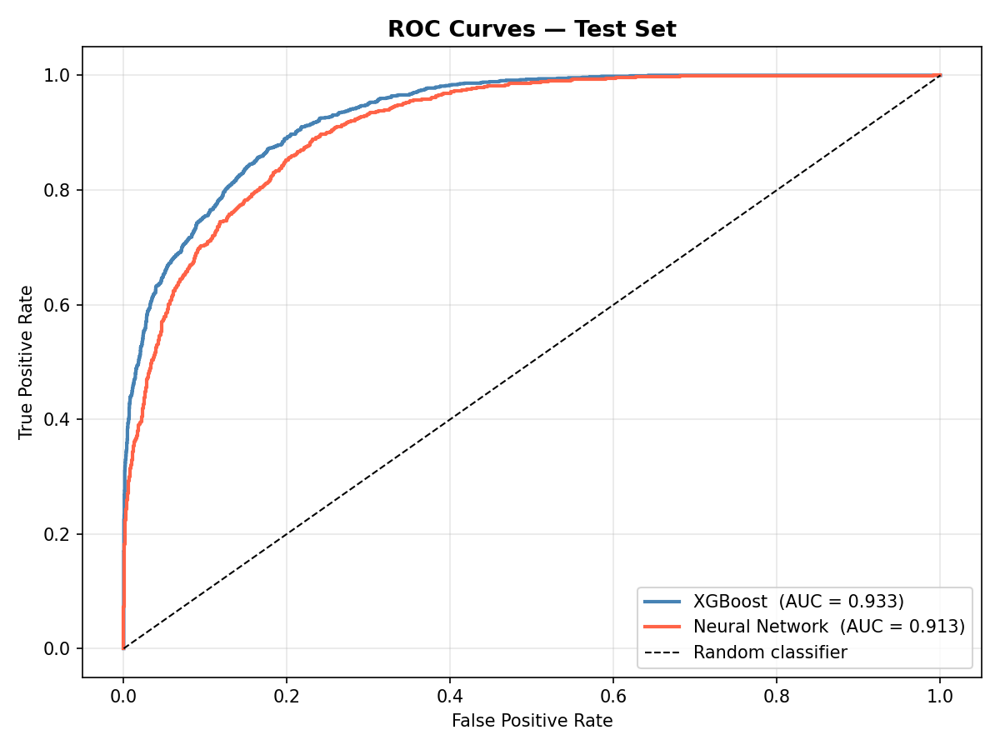

# Adult Census Income | ML Pipeline
**Φοιτητής:** Μάρκος Συρούκης  
**A.M.:** 09325023  
**Εξάμηνο:** 2ο  
**Μάθημα:** Hands-on AI Homework 1  
**Σχολή:** ΣΕΜΦΕ, ΕΜΠ  

---

## 1. Περιγραφή Προβλήματος

Το πρόβλημα αφορά την **δυαδική ταξινόμηση** εισοδήματος: δεδομένων δημογραφικών και εργασιακών χαρακτηριστικών ενός ατόμου, προβλέπουμε αν το ετήσιο εισόδημά του υπερβαίνει τα $50.000 ή όχι.

Η πρόβλεψη εισοδηματικής κατηγορίας έχει εφαρμογές σε τομείς όπως η στοχευμένη διαφήμιση, ο σχεδιασμός κοινωνικής πολιτικής, η αξιολόγηση πιστοληπτικής ικανότητας και η ανάλυση κοινωνικοοικονομικών ανισοτήτων. Επομένως το εγχείρημα της πρόβλεψής μας έχει επεκτάσεις σε πολλούς τομείς.

**Τύπος:** Binary Classification (`<=50K` → 0, `>50K` → 1)

---

## 2. Περιγραφή Dataset

- **Πηγή:** [UCI Adult Census Income Dataset](https://archive.ics.uci.edu/dataset/2/adult)
- **Γραμμές:** 48.842
- **Στήλες:** 15 (14 features + 1 target)

### Χαρακτηριστικά (Features)

| Feature | Τύπος | Περιγραφή |
|---------|-------|-----------|
| `age` | Αριθμητικό | Ηλικία ατόμου |
| `workclass` | Κατηγορικό | Τύπος εργοδότη (Private, State-gov, Self-emp κ.λπ.) |
| `fnlwgt` | Αριθμητικό | Βάρος δειγματοληψίας Census — αντιπροσωπεύει πόσα άτομα στον πληθυσμό μοιράζονται παρόμοια δημογραφικά χαρακτηριστικά |
| `education` | Κατηγορικό | Επίπεδο εκπαίδευσης (Bachelors, HS-grad, Masters κ.λπ.) |
| `education_num` | Αριθμητικό | Αριθμητική αναπαράσταση του επιπέδου εκπαίδευσης (1–16) |
| `marital_status` | Κατηγορικό | Οικογενειακή κατάσταση |
| `occupation` | Κατηγορικό | Επάγγελμα |
| `relationship` | Κατηγορικό | Ρόλος στο νοικοκυριό |
| `race` | Κατηγορικό | Φυλή |
| `sex` | Κατηγορικό (δυαδικό) | Φύλο (Male / Female) |
| `capital_gain` | Αριθμητικό | Κεφαλαιακά κέρδη |
| `capital_loss` | Αριθμητικό | Κεφαλαιακές ζημίες |
| `hours_per_week` | Αριθμητικό | Ώρες εργασίας ανά εβδομάδα |
| `native_country` | Κατηγορικό | Χώρα καταγωγής (41 μοναδικές τιμές) |

### Target Variable

| Κλάση | Ποσοστό | Πλήθος |
|-------|---------|--------|
| `<=50K` (0) | ~76% | 37.155 |
| `>50K` (1) | ~24% | 11.687 |

Η πρώτη άμεση παρατήρηση που μπορούμε να κάνουμε είναι ότι το dataset είναι **ασύμμετρο (imbalanced)**, με περίπου 3:1 αναλογία. Αυτό σημαίνει ότι ένα μοντέλο που προβλέπει πάντα `<=50K` θα πετύχαινε 76% accuracy χωρίς να μαθαίνει τίποτα. Γι' αυτό χρησιμοποιούμε `scale_pos_weight` και αξιολογούμε με F1 και ROC-AUC αντί μόνο accuracy.

---

## 3. Preprocessing Pipeline

Η σειρά εκτέλεσης είναι κρίσιμη: **πρώτα split, μετά preprocessing**.

Όλα τα στατιστικά (medians, modes, IQR bounds, scaler parameters) υπολογίζονται **αποκλειστικά στο training set** και εφαρμόζονται στα validation/test sets, αποφεύγοντας data leakage.

### 3.1 Split (80/10/10)

Stratified split σε δύο βήματα για να διατηρηθεί η αναλογία κλάσεων:
1. 10% → Test set
2. Από το υπόλοιπο 90%, ~11% → Validation set

Αποτέλεσμα: **Train: 39.073** | **Val: 4.884** | **Test: 4.885**

### 3.2 Missing Values

Οι ελλιπείς τιμές (κωδικοποιημένες ως `?` στο αρχικό dataset, μετατρεπόμενες σε `NaN` κατά το parsing) αντιμετωπίζονται με **mode imputation** από το training set:

- `workclass` → Private
- `occupation` → Prof-specialty
- `native_country` → United-States

### 3.3 Outlier Treatment (IQR Winsorizing)

Μέθοδος IQR: τιμές εκτός `[Q1 - 1.5·IQR, Q3 + 1.5·IQR]` κόβονται (clip) στα όρια.

| Feature | Lower | Upper |
|---------|-------|-------|
| `age` | -2.00 | 78.00 |
| `fnlwgt` | -62.342 | 418.197 |
| `hours_per_week` | 32.50 | 52.50 |

Χαρακτηριστικό παράδειγμα είναι η μεταβλητή `hours_per_week`. Η πλειοψηφία γύρω στις 40 ώρες, αλλά υπάρχουν ακραίες τιμές (1–99) που αντιμετωπίζονται με IQR clipping.

**Εξαίρεση:** Τα `capital_gain` και `capital_loss` εξαιρούνται είναι sparse features (>90% μηδενικά), επομένως IQR = 0 και η εφαρμογή clipping θα τα μηδένιζε πλήρως, καταστρέφοντας πληροφορία.
Αντίθετα θα χρησιμοποιηθούν στο επόμενα βήμα ώστε να κατασκευάσουν ένα νέο feature το (`capital_net`).

Επομένως επιλέξαμε την IQR έναντι της Z-score καθώς η δεύτερη προϋποθέτει κανονική κατανομή των δεδομένων, κάτι που δεν ισχύει για τα περισσότερα features του dataset (π.χ. `capital_gain` είναι heavily skewed). 
Η IQR είναι πιο robust σε μη κανονικές κατανομές καθώς βασίζεται σε ποσοστημόρια αντί μέσου όρου και τυπικής απόκλισης.
Τέλος επιλέξαμε Winsorizing απο το να αφαιρέσουμε τα outliers καθώς με την δεύτερη επιλογή θα μειώναμε τον όγκο του dataset και ίσως εισαγάγαμε bias.
Για παράδειγμα αφαιρώντας άτομα που δουλεύουν +60 ώρες την εβδομάδα χάνουμε πληροφορία για το υψηλό εισόδημα. Το clipping θα διατηρήσει τις εγγραφές περιορίζοντας μόνο τις ακραίες τιμές στα όρια του IQR. 

### 3.4 Categorical Encoding

- **Label Encoding:** `sex` (δυαδικό: Female → 0, Male → 1)
- **Grouping:** `native_country`. Επιλέξαμε να κρατήσουμε top 5 χώρες και να θέσουμε τις υπόλοιπες ως `"Other"`
#### Γιατί κρατάμε μόνο τις Top 5 χώρες

Η στήλη `native_country` έχει 41 μοναδικές τιμές, αλλά η κατανομή είναι εξαιρετικά ανομοιόμορφη:

| Χώρα | Ποσοστό |
|------|---------|
| United-States | ~89.6% |
| Mexico | ~2.0% |
| Philippines | ~0.6% |
| Germany | ~0.4% |
| Puerto-Rico | ~0.4% |
| **Υπόλοιπες 36 χώρες** | **~7.0%** |

Η one-hot encoding 41 χωρών θα δημιουργούσε 40 επιπλέον στήλες, οι περισσότερες σχεδόν μηδενικές. Ομαδοποιώντας τις σπάνιες χώρες σε `"Other"`, μειώνουμε τις OHE στήλες κατά ~35 χωρίς απώλεια πληροφορίας καθώς οι σπάνιες κατηγορίες δεν έχουν αρκετά δείγματα ώστε το μοντέλο να μάθει κάτι αξιόπιστο από αυτές.

- **One-Hot Encoding:** `workclass`, `education`, `marital_status`, `occupation`, `relationship`, `race`, `native_country` (με `drop='first'` για αποφυγή multicollinearity)

Αποτέλεσμα: **55 OHE στήλες** (αντί ~90 χωρίς grouping που πραγματοποιήσαμε προηγουμένως)

### 3.5 Feature Scaling

**StandardScaler** (zero mean, unit variance) fitted στο training set. Ο scaler αποθηκεύεται στο `models/scaler.pkl` για επαναχρησιμοποίηση.

Στο τέλος του pipeline αποθηκεύονται όλα τα preprocessing artifacts που χρειάζεται το API για να εφαρμόσει τον ίδιο μετασχηματισμό σε νέα δεδομένα:

- `models/scaler.pkl` — StandardScaler
- `models/ohe_encoder.pkl` — OneHotEncoder
- `models/preprocessing_meta.pkl` — mode values για imputation, IQR bounds, top countries, label encoders

---

## 4 Feature Engineering

Δύο νέα features:

1. **`capital_net`** = `capital_gain` - `capital_loss`
   - *Λογική:* Το καθαρό κεφαλαιακό κέρδος/ζημία είναι πιο ενδεικτικό του εισοδήματος από τα δύο ξεχωριστά.

2. **`hours_education_interaction`** = `hours_per_week` × `education_num`
   - *Λογική:* Συνδυάζει εργασιακή ένταση με μορφωτικό επίπεδο. Κάποιος που δουλεύει πολλές ώρες ΚΑΙ έχει υψηλή μόρφωση έχει πολύ μεγαλύτερη πιθανότητα να κερδίζει >50K.
   Σημείωση **`education` vs `education_num`:** Κωδικοποιούν την ίδια πληροφορία. Κρατάμε και τα δύο όπου το `education_num` χρησιμοποιείται στο feature engineering, ενώ το `education` γίνεται OHE.

---

## 5. PCA Insights

Η PCA εφαρμόζεται στα scaled training data ως **exploratory ανάλυση** και δεν αντικαθιστά τα features.

### Scree Plot



Χρειάζονται **47 components** για να καλυφθεί το 90% της συνολικής διακύμανσης (από 65 συνολικά). Η καμπύλη ανεβαίνει σταδιακά χωρίς απότομη κλίση, δείχνοντας ότι η πληροφορία είναι διασκορπισμένη σε πολλές διαστάσεις. Το οποίο είναι αναμενόμενο σε dataset με πολλές OHE στήλες.

### Κυρίαρχα features ανά component

**PC1** (κυρίαρχος άξονας διακύμανσης):
- `hours_education_interaction` (0.43)
- `education_num` (0.39)
- `hours_per_week` (0.25)
- `marital_status_Married-civ-spouse` (0.24)

**PC2:**
- `marital_status_Married-civ-spouse` (0.39)
- `marital_status_Never-married` (0.38)
- `education_num` (0.30)
- `age` (0.27)

### 2D Projection



Το scatter plot δείχνει **μερικό διαχωρισμό** μεταξύ των δύο κλάσεων κατά μήκος του PC1. Παρατηρούμε ότι τα άτομα με υψηλό εισόδημα (κόκκινο) τείνουν προς θετικές τιμές PC1 
δηλαδή υψηλή εκπαίδευση & πολλές ώρες εργασίας. Αντιθέτως τα χαμηλού εισοδήματος (μπλε) συγκεντρώνονται αριστερά. Η επικάλυψη στο κέντρο επιβεβαιώνει ότι δύο components δεν αρκούν για πλήρη διαχωρισμό,
ωστόσο βλέπουμε μια πρώτη τάση.

---

## 6. Model Training

### 6.1 XGBoost (Classical ML)

| Παράμετρος | Τιμή | Αιτιολόγηση |
|-----------|-------|-------------|
| `n_estimators` | 500 | Ανώτατο όριο — early stopping σταματά νωρίτερα |
| `max_depth` | 5 | Αρκετή πολυπλοκότητα χωρίς overfitting |
| `learning_rate` | 0.03 | Αργό learning για καλύτερο generalization |
| `subsample` | 0.8 | Row sampling για regularization |
| `colsample_bytree` | 0.8 | Feature sampling ανά δέντρο |
| `min_child_weight` | 3 | Αποτρέπει πολύ εξειδικευμένα splits |
| `scale_pos_weight` | 3.18 | Αντιστάθμιση class imbalance (76/24) |
| `eval_metric` | logloss | Ομαλότερο gradient από AUC για early stopping |
| `early_stopping_rounds` | 20 | Patience |

### Learning Curve



Οι καμπύλες train/validation logloss συγκλίνουν ομαλά και παραμένουν κοντά σε όλη τη διάρκεια του training, με μια ελάχιστη απόκλιση στα τελευταία iterations.
Το early stopping δεν ενεργοποιήθηκε, δηλαδή το μοντέλο συνέχισε να βελτιώνεται μέχρι το τέλος των 500 rounds (best iteration: 499).

### Feature Importance



Τα κυρίαρχα features είναι το `marital_status_Married-civ-spouse` και `marital_status_Never-married`, με διαφορά από τα υπόλοιπα.
Ουσιαστικά η οικογενειακή κατάσταση είναι ο ισχυρότερος προβλεπτικός παράγοντας εισοδήματος για το XGBoost. 
Ακολουθούν τα engineered features (`hours_education_interaction`, `capital_net`) και τα `capital_gain`, `education_num`, επιβεβαιώνοντας τα ευρήματα της PCA. 
Αξίζει να σημειωθεί ότι τα νέα features που δημιουργήσαμε στο Feature Engineering εμφανίζονται στο top 5, δικαιώνοντας τη σχεδιαστική τους λογική.

### 6.2 Neural Network (PyTorch)

**Αρχιτεκτονική:**
```
Input(65) → Linear(128) → ReLU → Dropout(0.4)
          → Linear(64)  → ReLU → Dropout(0.4)
          → Linear(32)  → ReLU
          → Linear(1)   → Sigmoid
```

| Παράμετρος | Τιμή |
|-----------|-------|
| Optimizer | Adam |
| Learning rate | 0.0003 |
| Batch size | 64 |
| Loss | Weighted BCE (pos_weight=3.18) |
| Early stopping | Patience=10, παρακολούθηση val F1 |
| Trainable params | ~23.000 |

**Παρατήρηση:** Χρήση `ReLU` ως default activation. Δοκιμάστηκαν και `LeakyReLU`/`ELU`. Ωστόσο η `ReLU` έδωσε τα καλύτερα αποτελέσματα σε αυτό το dataset.
Επιπλέον, για την αξιολόγηση κατά το Early Stopping επιλέχθηκε το F1-score, καθώς η μεταβλητή-στόχος (target variable) είναι μη ισορροπημένη (imbalanced), η επιλογή αυτή διασφαλίζει ότι δεν θα έχουμε παραπλανητικά αποτελέσματα που θα μπορούσαν να προκύψουν από τη χρήση άλλων μετρικών.
Τέλος και οι υπόλοιπες υπερπαράμετροι του μοντέλου επιλέχθηκαν μετά απο σειρά δοκιμών.
### Loss Curve



Όπως βλέπουμε στο γράφημα το early stopping ενεργοποιήθηκε στο epoch 23, με best epoch το 13 (αποθήκευση βαρών μοντέλου). 
Η validation loss σταθεροποιείται γρήγορα μετά το epoch 10, ενώ η train loss συνεχίζει να πέφτει το οποίο μας δείχνει ότι το μοντέλο αρχίζει να κάνει overfit. 
Η μικρή διαφορά μεταξύ train και validation loss δείχνει ότι το dropout (0.4) λειτουργεί αποτελεσματικά ως regularizer, αλλά το δίκτυο εξαντλεί γρήγορα το signal του dataset.
Το οποίο είναι αντίθετο από το XGBoost που συνέχισε να βελτιώνεται για 500 rounds.

### 6.3. Evaluation & Model Comparison

Αξιολόγηση **μόνο στο test set** το οποίο δεν χρησιμοποιήθηκε ποτέ κατά τη διάρκεια training ή tuning.

| Metric | XGBoost | Neural Net | Winner |
|--------|---------|------------|--------|
| Accuracy | 0.8348 | 0.8156 | XGBoost |
| Precision | 0.6086 | 0.5791 | XGBoost |
| Recall | 0.8674 | 0.8392 | XGBoost |
| F1 | 0.7153 | 0.6853 | XGBoost |
| ROC-AUC | 0.9327 | 0.9149 | XGBoost |

### Graphs & Confusion Matrices





Ο XGBoost ταξινομεί σωστά 86 περισσότερα <=50K δείγματα (3064 vs 2978) και χάνει λιγότερα >50K (155 vs 173 false negatives). Και τα δύο μοντέλα κάνουν περισσότερα false positive λάθη (652/738) από false negative το οποίο είναι αποτέλεσμα του `scale_pos_weight` που ευνοεί το recall της μειονοτικής κλάσης.



Η ROC καμπύλη του XGBoost (AUC=0.933) βρίσκεται σταθερά πάνω από αυτή του Neural Network (AUC=0.913), ιδιαίτερα στην περιοχή χαμηλού FPR (0–0.2) που είναι και η πιο πρακτικά σημαντική.

### Ανάλυση

- Ο **XGBoost υπερτερεί σε όλα τα metrics**. Βλέπουμε την τάση ότι σε tabular datasets μεσαίου μεγέθους (~40K γραμμές), tree-based μοντέλα σταθερά ξεπερνούν απλά feedforward networks.
- Η **loss curve** του NN δείχνει early stopping στο epoch ~23, ενδεικτικό ότι το μοντέλο εξάντλησε γρήγορα το signal.
- Τα **feature importances** του XGBoost (κυρίαρχα: `capital_net`, `education_num`, `hours_education_interaction`, `age`, `marital_status`) συνάδουν με τα PCA loadings.  Γεγονός που επιβεβαιώνει ότι και οι δύο μέθοδοι εντοπίζουν τα ίδια πληροφοριακά χαρακτηριστικά.
- Η διαφορά ROC-AUC (~0.018) **δεν δικαιολογεί** την πρόσθετη πολυπλοκότητα του neural network αλλά και τον παραπάνω χρόνο που χρειάζεται για training/inference.
---

## 7. Best Model Designation

**Best model: XGBoost** → αποθηκεύεται ως `models/best_model.pkl`

Η επιλογή βασίζεται στο **ROC-AUC** (0.9327 vs 0.9149) ως primary metric, με επιβεβαίωση από F1 (0.7153 vs 0.6853). Το ROC-AUC επιλέχθηκε ως κύριο metric γιατί μετρά τη διακριτική ικανότητα σε όλα τα thresholds και δεν επηρεάζεται από class imbalance.

---

## 8. Installation & Execution

### Προαπαιτούμενα

- Python 3.12+
- CUDA (προαιρετικά, για GPU training του NN)

### Εγκατάσταση

```bash
git clone -b main https://github.com/MarkosSi34/hands-on-ai-hw1.git
cd hands-on-ai-hw1
python3 -m venv .venv
source .venv/bin/activate
pip install -r requirements.txt
```

### Εκτέλεση

```bash
# Full pipeline (train + evaluate both models + save the best)
python3 main.py --model both

# Only XGBoost (train + evaluate)
python3 main.py --model xgb

# Only Neural Network (train + evaluate)
python3 main.py --model nn

# Hyperparameter tuning for XGBoost
python3 main.py --tune
```

> **Σημείωση:** Όλα τα random seeds είναι `42` για αναπαραγωγιμότητα.

---
## Hyperparameter Tuning (Task 6)

**Μέθοδος:** `RandomizedSearchCV` με 5-fold Stratified Cross-Validation στο training set.

**Search space:**

| Παράμετρος | Τιμές |
|-----------|-------|
| `max_depth` | [3, 5, 6, 7, 9] |
| `learning_rate` | [0.01, 0.05, 0.1, 0.2] |
| `n_estimators` | [100, 300, 500, 700] |
| `subsample` | [0.6, 0.8, 1.0] |
| `colsample_bytree` | [0.6, 0.8, 1.0] |

### Αποτελέσματα (Validation Set)

| Metric | Base | Tuned | Diff |
|--------|------|-------|------|
| Accuracy | 0.8368 | 0.8378 | +0.0010 |
| Precision | 0.6111 | 0.6135 | +0.0024 |
| Recall | 0.8751 | 0.8717 | -0.0034 |
| F1 | 0.7197 | 0.7201 | +0.0005 |
| ROC-AUC | 0.9304 | 0.9321 | +0.0017 |

### Αποτελέσματα (Test Set)

| Metric | Base | Tuned | Diff |
|--------|------|-------|------|
| Accuracy | 0.8348 | 0.8411 | +0.0063 |
| Precision | 0.6086 | 0.6205 | +0.0118 |
| Recall | 0.8674 | 0.8657 | -0.0017 |
| F1 | 0.7153 | 0.7229 | +0.0075 |
| ROC-AUC | 0.9327 | 0.9346 | +0.0019 |

Τα αποτελέσματα στο test set επιβεβαιώνουν τη βελτίωση του tuned μοντέλου, με πιο αισθητές διαφορές από ό,τι στο validation set, ιδιαιτέρως σε Precision (+0.012) και F1 (+0.008). Το tuned μοντέλο υπερτερεί σε 4/5 metrics, με μόνο οριακή υποχώρηση στο Recall.

**Συμπέρασμα:** Το tuning επιβεβαίωσε ότι οι baseline υπερπαράμετροι ήταν ήδη κοντά στο βέλτιστο. Οι βελτιώσεις είναι οριακές αλλά συνεπείς σε 4/5 metrics.

---

## FastAPI Endpoint (Task 5)

REST API που εκθέτει το best model μέσω FastAPI.

### Endpoints

- `POST /predict` — δέχεται raw features, εφαρμόζει preprocessing, επιστρέφει πρόβλεψη
- `GET /health` — health check

### Παράδειγμα

**Request:**
```json
{
  "age": 39,
  "workclass": "State-gov",
  "fnlwgt": 77516,
  "education": "Bachelors",
  "education_num": 13,
  "marital_status": "Never-married",
  "occupation": "Adm-clerical",
  "relationship": "Not-in-family",
  "race": "White",
  "sex": "Male",
  "capital_gain": 2174,
  "capital_loss": 0,
  "hours_per_week": 40,
  "native_country": "United-States"
}
```

**Response:**
```json
{
  "prediction": 0,
  "label": "<=50K",
  "probability": 0.3241
}
```

### Docker Process

**Build του Docker image:**
```bash
cd hands-on-ai-hw1
docker build -t income-api .
```
Κατασκευάζει το Docker image από το `Dockerfile` που βρίσκεται στο root του project (`hands-on-ai-hw1/Dockerfile`). Το flag `-t income-api` ονομάζει το image ως `income-api`.

**Εκκίνηση container:**
```bash
docker run -dit --name income-api -p 8080:8080 income-api
```
- `-d` : τρέχει στο background 
- `-it` : interactive terminal 
- `--name income-api` : ονομάζει το container
- `-p 8080:8080` : συνδέει το port 8080 του container με το port 8080 του host

**Επαλήθευση ότι τρέχει:**
```bash
docker ps -a
```
Θα πρέπει να εμφανίζεται το container `income-api` με status `Up`.

**Χρήση του API:**

Μέσω browser (Swagger UI): http://localhost:8080/docs

Μέσω `curl`:

Παράδειγμα αναμενόμενο >50K:
```bash
curl -X POST http://localhost:8080/predict \
  -H "Content-Type: application/json" \
  -d '{
    "age": 52,
    "workclass": "Self-emp-inc",
    "fnlwgt": 209642,
    "education": "Masters",
    "education_num": 14,
    "marital_status": "Married-civ-spouse",
    "occupation": "Exec-managerial",
    "relationship": "Husband",
    "race": "White",
    "sex": "Male",
    "capital_gain": 15024,
    "capital_loss": 0,
    "hours_per_week": 55,
    "native_country": "United-States"
  }'
```

Παράδειγμα αναμενόμενο <=50K:
```bash
curl -X POST http://localhost:8080/predict \
  -H "Content-Type: application/json" \
  -d '{
    "age": 39,
    "workclass": "State-gov",
    "fnlwgt": 77516,
    "education": "Bachelors",
    "education_num": 13,
    "marital_status": "Never-married",
    "occupation": "Adm-clerical",
    "relationship": "Not-in-family",
    "race": "White",
    "sex": "Male",
    "capital_gain": 2174,
    "capital_loss": 0,
    "hours_per_week": 40,
    "native_country": "United-States"
  }'
```

Health check:
```bash
curl http://localhost:8080/health
```
Αν δεν χρειάζεστε πλέον το container:
```bash
docker stop income-api && docker rm income-api
```
Αν δεν επιθυμείτε πλέον το docker image απλά τρέξτε
```bash
docker rmi income-api
```

---

## 10. Project Structure

```
hands-on-ai-hw1/
├── main.py                    # Entry point
├── data/
│   └── adult_census_income.csv
├── models/
│   ├── classical_model.pkl    # XGBoost
│   ├── neural_network.pt      # NN weights
│   ├── best_model.pkl         # Best model (XGBoost)
│   ├── scaler.pkl             # StandardScaler
│   ├── ohe_encoder.pkl        # OneHotEncoder
│   ├── preprocessing_meta.pkl # Imputation/IQR/country metadata
│   └── tuned_classical_model.pkl
├── src/
│   ├── preprocessing.py
│   ├── train_classical.py
│   ├── train_neural.py
│   ├── evaluate.py
│   ├── tuning.py
│   └── api.py
├── plots/                     # Generated plots
├── requirements.txt
├── requirements-api.txt
├── Dockerfile
└── README.md
```

---